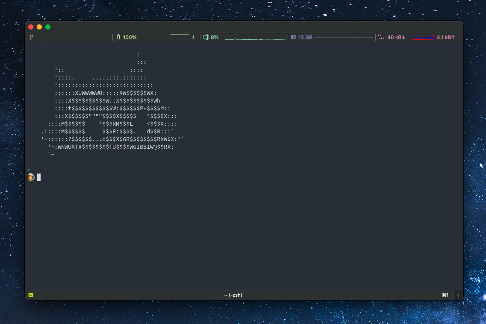
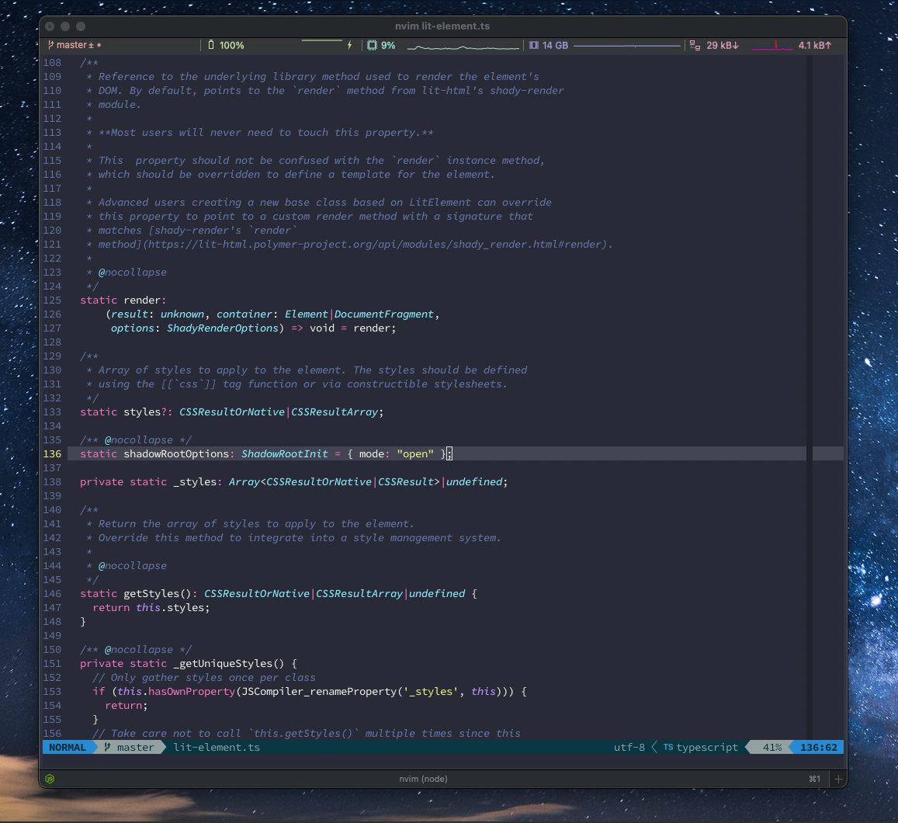
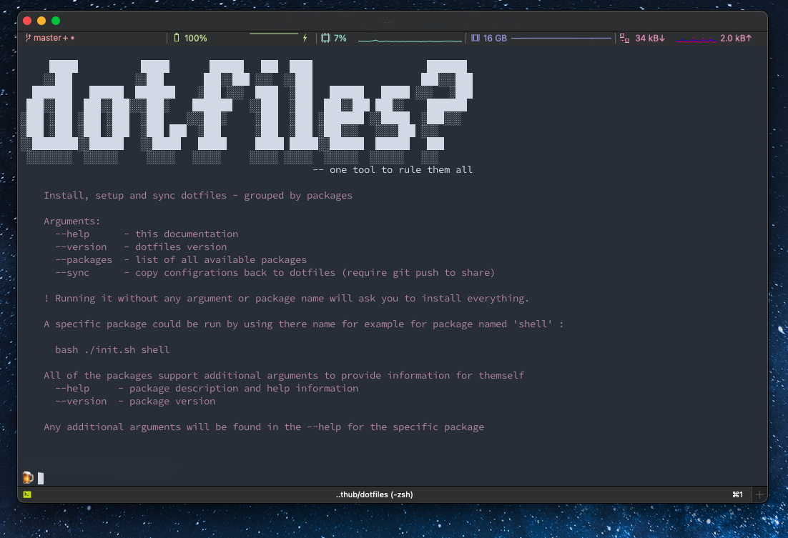

# dotfiles

Personal dotfile script to setup and maintain my configuration across multiple devices




Also include configuration for NeoVim and Vim




### Usage

Clone this repository:

```bash
git clone https://github.com/bdryanovski/dotfiles
```

Inside it just run the basic task for the first time

```bash
bash init.sh --help
```




### Run specific package
The dotfiles are build with the idea that multiple packages could be run one at the time without depending much on other packages.

This is not true for all packages but in general this is the idea.

To run a package just mention his name as first argument:

```bash
bash init.sh shell
```

The above command will run only the `shell` package and nothing more.

### Helpers

Helpers is a collections of useful functions that are used across packages - this way a single change could be apply to multiple files, keep everything the same, and simplify a lot of clunky BASH functionality.

### Packages

Packages are located inside `packages` folder. Everyone must include `init.sh` script, everything inside it is optional.

The basic structure is that every package support few things as commands:

  * help - provide description of the package usage
  * version - give information about the package version
  * setup - the initial task to be run without any arguments
  * sync - syncing the current stage of the computer with the package - (they way to move things between machines)

To get the full list of available packages run:

```bash
bash init.sh --packages
```


### Versioning

There are a lot of internl version here - so some explanation will be needed. The main version, also known as `Dotfile version` is the version of the Dotfile itself and cover UI, Helpers and everything releated to the install, sync and update tooling.

Every package have it's own version, this way I could track what version I'm running on my machine and do I need to update or not? Few of the packages could have a bigger version than other - just because they don't update that often, for example `base` package may not require a lot of changes over time like for example `vim` package that sync NeoVim across different machines and it's always under changes.

Running `--status` will return list of packages - the version it's installed and the version that the Dotfile have, marked with red are packages that are out of sync. This way after `git pull` I could compare what changed over time and do I want to update it.

### Banners

The banners are generated from here https://asciiart.club/ and are used to show the package that is currently running.
